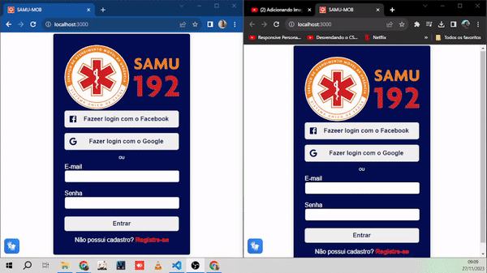

<h4 align="center">
    
</h4>

<h1 align="center">
    🚀 SAMU-MOB | SAMU Online
</h1>

<p align="center">
    Aplicação web desenvolvida em <strong>React + Firebase</strong>, com foco em <strong>acessibilidade, inovação e inclusão digital</strong> no atendimento de emergência.
</p>

---

## 📖 Sobre o Projeto

O **SAMU-Mob (SAMU Online)** é um protótipo acadêmico que tem como objetivo **modernizar e facilitar a chamada de emergência** para o Serviço de Atendimento Móvel de Urgência (SAMU).  

A aplicação traz recursos de **login social (Google/Facebook)**, **chat em tempo real** e **módulos de acessibilidade** como **Reconhecimento de Voz** e integração com **VLibras**, visando eliminar barreiras de comunicação e garantir que qualquer cidadão consiga solicitar ajuda de forma rápida e eficiente.

---

## 🎯 Objetivos

- Simplificar o acionamento do SAMU de forma acessível a todos.  
- Garantir inclusão para pessoas com diferentes necessidades (auditivas, motoras ou cognitivas).  
- Oferecer uma experiência responsiva, intuitiva e confiável em situações críticas.  

---

## ✅ Demonstração

<h4 align="center">
    
</h4>

## ✨ Funcionalidades

**Autenticação e Acesso**
- 🔵 Login com Google (Firebase Auth + GoogleAuthProvider)  
- 🔵 Login com Facebook (Firebase Auth + FacebookAuthProvider)  
- ✉️ Login com e-mail e senha (validação básica)  
- 🔐 Rotas protegidas com **React Router v6**

**Chat e Comunicação**
- 💬 Módulo de chat em tempo real  
- 🧩 Componentização (ChatHeader, ChatBody, ChatFooter)  
- 🎤 **Módulo Speech** (Reconhecimento de Voz – Web Speech API)  

**Acessibilidade**
- 🤟 Integração com **VLibras** (Língua Brasileira de Sinais Virtual)  
- 🎙️ **SpeechRecognition** para comandos por voz  
- Layout responsivo com **Styled-components**  

---

## 🧱 Estrutura do Projeto (simplificada)

src/
components/
Chat/
ChatHeader/
ChatBody/
ChatFooter/
Sidebar/
Header/
Footer/
SpeechRecognition/ (Speech.jsx)
pages/
Home/
Login/
index.js
styled.js
services/
firebase.js
firebaseConfig.js
Apis.js
styles/
global.js
App.js
Routes.js


---

## 🛠️ Stack & Dependências

- **React 18 (CRA)**  
- **React Router DOM v6** – Rotas e navegação  
- **Styled-components** – Estilização modular  
- **@mui/icons-material** – Ícones visuais  
- **Firebase** – Autenticação e banco em tempo real  
- **Web Speech API** – Reconhecimento de voz  
- **VLibras** – Inclusão em Libras  

---

<p align="center">
  
  
</p>

---

## ✅ Pré-requisitos

- Node.js (recomendado LTS: 18.x ou 20.x)  
- Yarn ou npm  
- Conta no Firebase com **Auth habilitado**  
- Provedores Google e Facebook ativados  
- Domínios autorizados: `localhost` (dev) e domínio de produção  

---

## ⚙️ Configuração do Firebase

```js
// src/services/firebaseConfig.js
export const firebaseConfig = {
  apiKey: "SUA_API_KEY",
  authDomain: "SEU_PROJETO.firebaseapp.com",
  projectId: "SEU_PROJETO_ID",
  storageBucket: "SEU_PROJETO.appspot.com",
  messagingSenderId: "SENDER_ID",
  appId: "APP_ID",
};

🚀 Como Executar Localmente
# 1) Clonar repositório

# Clone este repositório
$ git clone https://github.com/joseGjr/samuonline.git

# 2) Instalar dependências
yarn install    # ou npm install

# 3) Configurar Firebase
# -> criar src/services/firebaseConfig.js com suas credenciais

# 4) Rodar em desenvolvimento
yarn start      # ou npm start
# App em http://localhost:3000

# 5) Gerar build de produção
yarn build      # ou npm run build

🌍 Impacto e Diferenciais

O SAMU-Mob vai além de um simples protótipo acadêmico:

Une tecnologia e acessibilidade em saúde.

Explora inclusão digital como diferencial competitivo.

Demonstra capacidade de organização de projeto em camadas, integração com APIs e boas práticas de desenvolvimento.

Além da parte técnica, esse projeto evidencia minha experiência como Quality Assurance (QA), onde atuei em:

Definição e validação de cenários de testes (login social, chat, acessibilidade).

Execução de testes funcionais e exploratórios em fluxos críticos.

Garantia de usabilidade e experiência do usuário em dispositivos e navegadores distintos.
